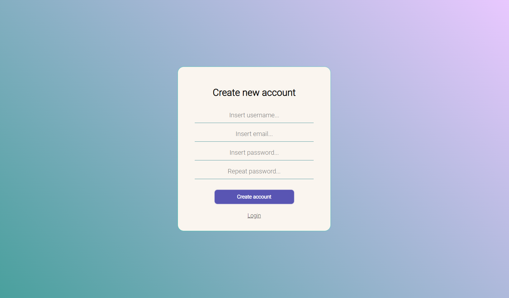
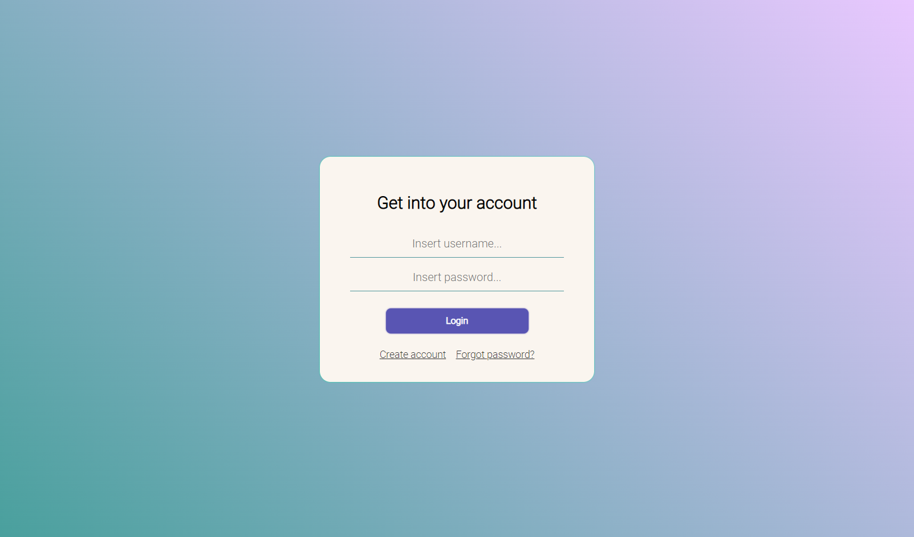
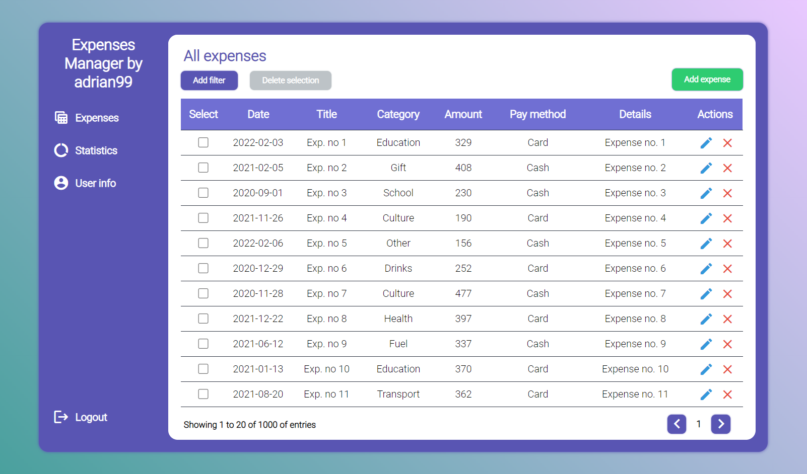

# Expenses Manager

## About
This project represents a simple "Expense Manager" web application in
which you create an account and add your expenses.

The application has a frontend and a backend, it can be used at the same time
as a website or as an api.

## Frontend

First, we need to create an account, after that we have to verify it via email.



After finishing the account verification, we get into our account.



The first page is the expense page where we can see the expenses. We can also add, edit
or delete an expense.



The application also has a statistics page and an user info page.

## Backend/API Documentation

### Create account example:

`# POST /api/createAccount`
```
Request Header:
 Content-Type: application/json
```
`Request Body`
```json
 {
   "username":"adi",   
   "email":"email@example.ex",
   "password":"pass"
 }
```

### Login example:  

`# POST /login`
```
Request Header:
 Content-Type: application/json
```
`Request Body:`
```json
{
  "username":"adi",   
  "password":"pass"
}
```
```
Response Header:
 Authorization : <JWTToken>
 Set-Cookie: Authorization= <JWTToken>
```

### Add expense example
` #POST /api/expense`  

```
Request Header:
 Content-Type: "application/json"
 
 Authorization: <JWTToken>
 OR
 Cookie: <JWTToken>
```
`Request Body`
```json
{
 "title":"Title",
 "category":"FUEL",
 "payMethod":"CASH",
 "date":"2022-02-02",
 "amount":"123.45",
 "details":"Details"
}
```